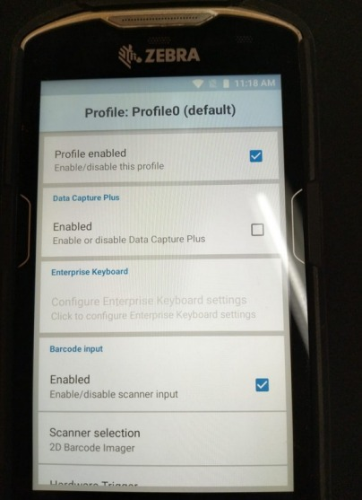
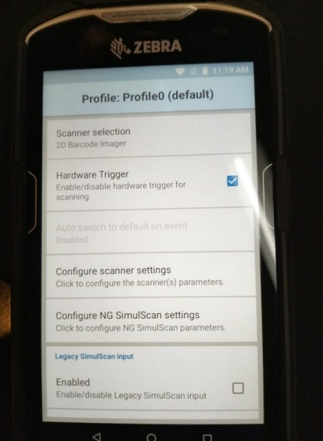
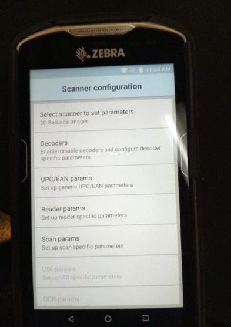
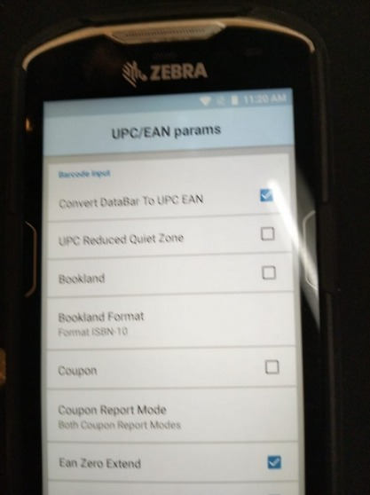
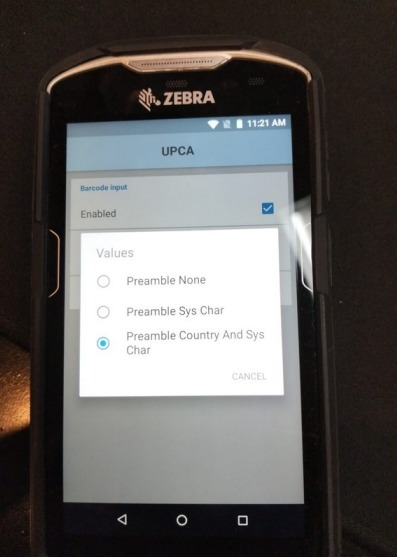
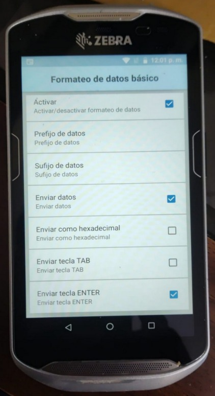
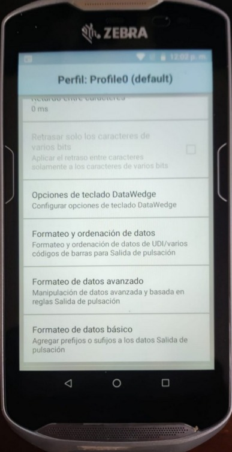
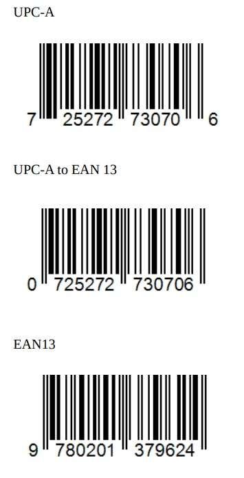

# 📝 Manual de Configuración DataWedge (Zebra TC56/TC70): UPC-A a EAN13

Este manual detalla los pasos para configurar la aplicación **DataWedge** en dispositivos Zebra TC56 o TC70, con el objetivo de escanear códigos **UPC-A** y que sean transmitidos automáticamente como códigos **EAN13**.

---

## 1. Acceso y Selección del Perfil

El primer paso es acceder a la aplicación DataWedge y seleccionar el perfil a configurar.

1.  Abre la aplicación **DataWedge**.
2.  Selecciona el perfil **`Profile0 (default)`**.

> **Nota:**
> * Asegúrate de que el perfil seleccionado esté **Enabled** (Habilitado).
> * El perfil `DWDemo` se utiliza para programas de demostración, y debe marcarse como habilitado cuando se realizan pruebas.
>   

---

## 2. Configuración de la Sección Barcode Input

Dentro del perfil, configura la sección "Barcode Input" para habilitar el escáner.

* Asegúrate de que la opción **`Enabled`** esté marcada.
* Asegúrate de que la opción **`Hardware Trigger`** esté marcada.
  
> 
> 
> 
> **Importante:**
> * Todas las configuraciones deben aplicarse tanto a la sección **Barcode Input** como a la sección **Pulse Section**.
> * Si la Pulse Section no está configurada, podría haber errores al leer la tecla Enter a través de los botones de pulso.

---

## 3. Configuración del Decodificador UPC-A

Para habilitar la conversión de UPC-A a EAN13, se debe configurar el decodificador dentro de los ajustes del escáner.

1.  Pulsa en **`Configure scanner settings`** (Configurar ajustes del escáner).
2.  Pulsa en **`Decoders`**.
3.  Localiza y **habilita** el decodificador **`UPCA`** marcando la casilla correspondiente.
4.  Para transmitir UPC-A como EAN13, es necesario configurar esta opción dentro de los parámetros del decodificador UPC-A (usualmente en `UPC/EAN params`).
   

### Parámetros Opcionales de UPC-A (Decoder Params)

* **Preámbulo (Preamble):** Si es necesario incluir el preámbulo (código de país y carácter de sistema), navega a `Decoder Params` y luego a `Preamble`. Elige la opción apropiada (ej: "Preamble Country and Sys Char" para USA).
* **Dígito de Chequeo (Report Check Digit):** Para incluir el dígito de chequeo, localiza la opción **`Report Check Digit`** dentro de `Decoder Params` y asegúrate de que esté habilitada.

---

## 4. Configuración de la Salida de Teclado (Keystroke Output)

Esta configuración define cómo se transmite el dato escaneado a la aplicación de destino.

Bajo la sección "Keystroke Output" (o sus equivalentes en español):

* **Enabled:** Sí.
* **Action Key:** None.
* **Inter Character Delay:** 1 ms.
* **Key Event Delay:** 1 ms.

### Formato de Datos Básico (Basic Data Formatting)

* **`Basic Data Formatting`** (Apply simple formatting for Keystroke output) debe estar habilitado.
* Asegúrate de que **`Send Data`** (Enviar datos) y **`Send Enter Key`** (Enviar tecla Enter) estén seleccionados.
* **Todas las demás configuraciones** deben estar **desmarcadas**.

> **Nota:** Para el desarrollo de aplicaciones Flutter, es crucial asegurar que el evento se transmita como carácter y que se añada la tecla Enter.

---
> 
> 
> 

## 5. Prueba de Conversión

Una vez completada la configuración, el dispositivo debe convertir el código UPC-A a su equivalente EAN13 al escanear.

| Código Original Escaneado (UPC-A) | Código Transmitido (EAN13) |
| :--- | :--- |
| **7** 25272 73070 **6** | **0**725272730706 |

---
> 

