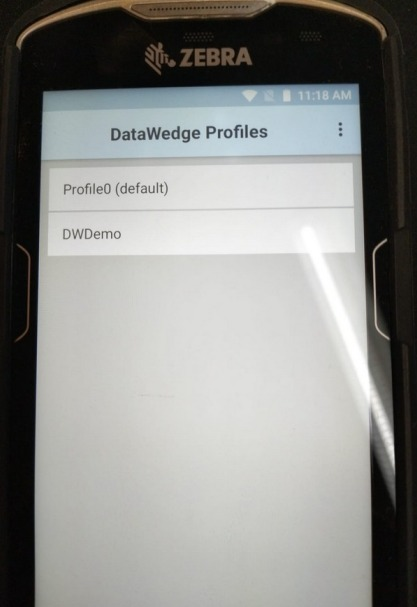
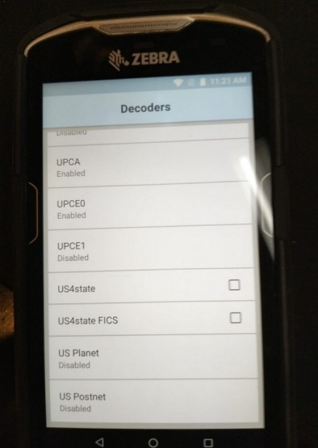
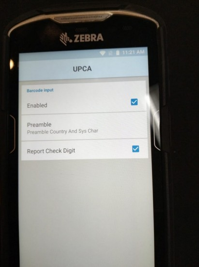
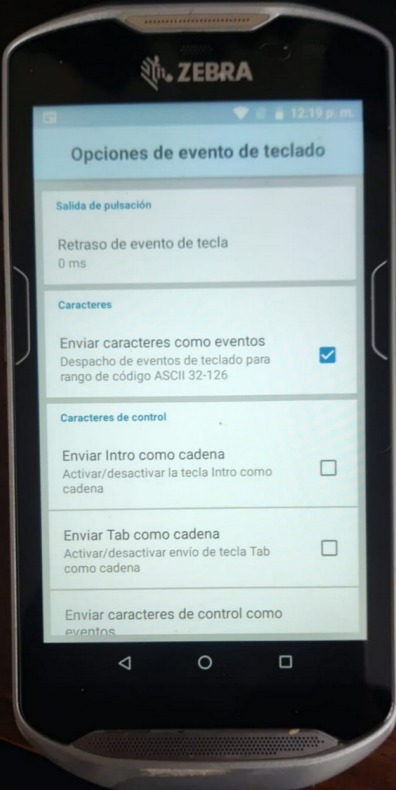

# 📝 DataWedge Configuration Manual (Zebra TC56/TC70): UPC-A to EAN13

This manual details the steps to configure the **DataWedge** application on Zebra TC56 or TC70 devices, with the goal of scanning **UPC-A** barcodes and having them automatically transmitted as **EAN13** codes.

---

## 1. Access and Profile Selection

The first step is to access the DataWedge application and select the profile to configure.

1. Open the **DataWedge** application.
2. Select the **`Profile0 (default)`** profile.

> **Note:**
> * Ensure the selected profile is **Enabled**.
> * The `DWDemo` profile is used for demonstration programs and must be checked as enabled when performing tests.
> 

---

## 2. Barcode Input Section Configuration

Within the profile, configure the "Barcode Input" section to enable the scanner.

* Ensure the **`Enabled`** option is checked.
* Ensure the **`Hardware Trigger`** option is checked.

> 
> 
> 
> **Important:**
> * All configurations must be applied to both the **Barcode Input** section and the **Pulse Section**.
> * If the Pulse Section is not configured, errors may occur when reading the Enter key via the pulse buttons.

---

## 3. UPC-A Decoder Configuration

To enable the conversion from UPC-A to EAN13, the decoder must be configured within the scanner settings.

1. Tap on **`Configure scanner settings`**.
2. Tap on **`Decoders`**.
3. Locate and **enable** the **`UPCA`** decoder by checking the corresponding box.
4. To transmit UPC-A as EAN13, this option must be configured within the UPC-A decoder parameters (usually under `UPC/EAN params`).

### Optional UPC-A Parameters (Decoder Params)

* **Preamble:** If it is necessary to include the preamble (country code and system character), navigate to `Decoder Params` and then `Preamble`. Choose the appropriate option (e.g., "Preamble Country and Sys Char" for USA).
* **Report Check Digit:** To include the check digit, locate the **`Report Check Digit`** option within `Decoder Params` and ensure it is enabled.

---

## 4. Keystroke Output Configuration

This configuration defines how the scanned data is transmitted to the target application.

Under the "Keystroke Output" section (or its Spanish equivalents):

* **Enabled:** Yes.
* **Action Key:** None.
* **Inter Character Delay:** 1 ms.
* **Key Event Delay:** 1 ms.

### Basic Data Formatting

* **`Basic Data Formatting`** (Apply simple formatting for Keystroke output) must be enabled.
* Ensure that **`Send Data`** and **`Send Enter Key`** are selected.
* **All other settings** must be **unchecked**.

> **Note:** For Flutter application development, it is crucial to ensure the event is transmitted as a character and that the Enter key is added.

---
> 
> 
> 

## 5. Conversion Test

Once the configuration is complete, the device must convert the UPC-A code to its EAN13 equivalent upon scanning.

| Original Scanned Code (UPC-A) | Transmitted Code (EAN13) |
| :--- | :--- |
| **7** 25272 73070 **6** | **0**725272730706 |

---
> 